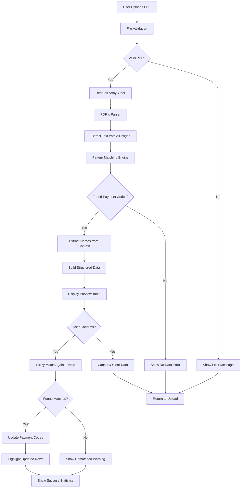
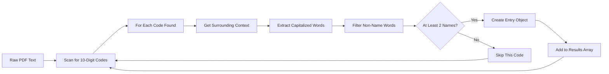
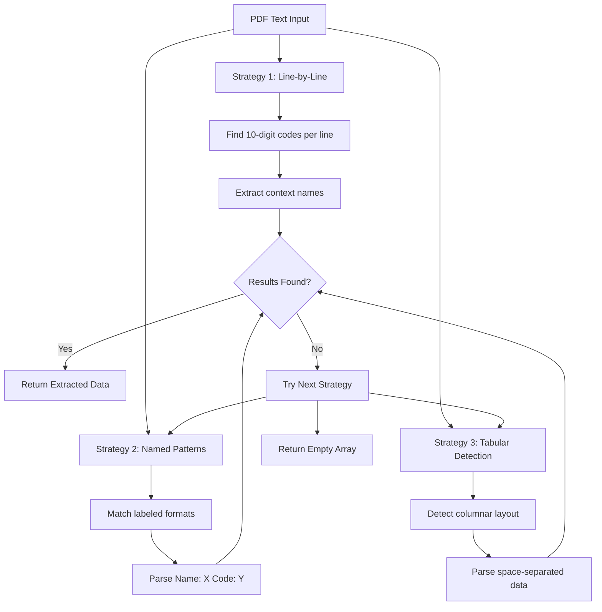
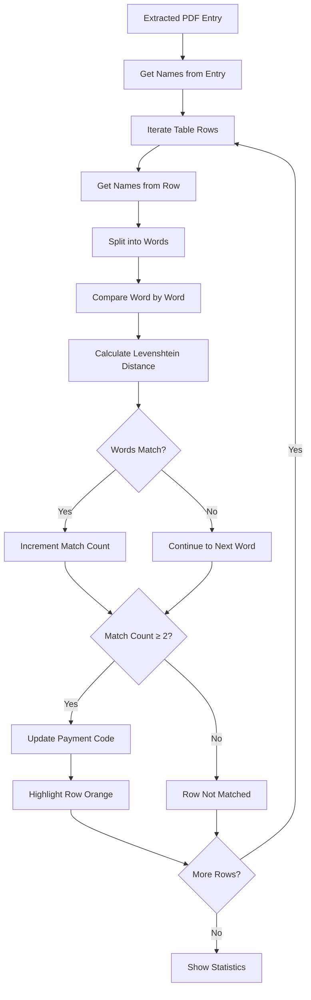
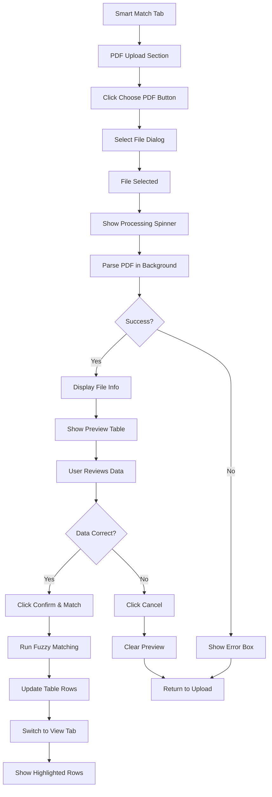
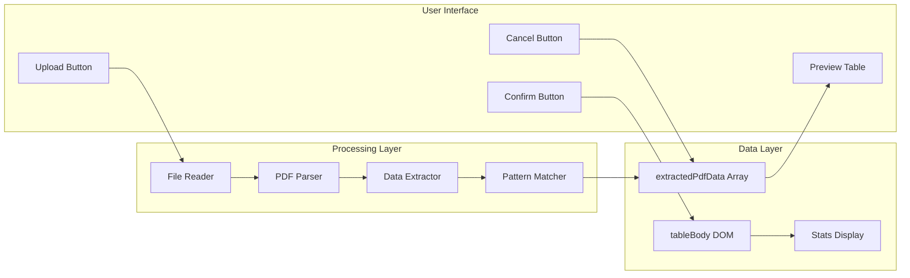
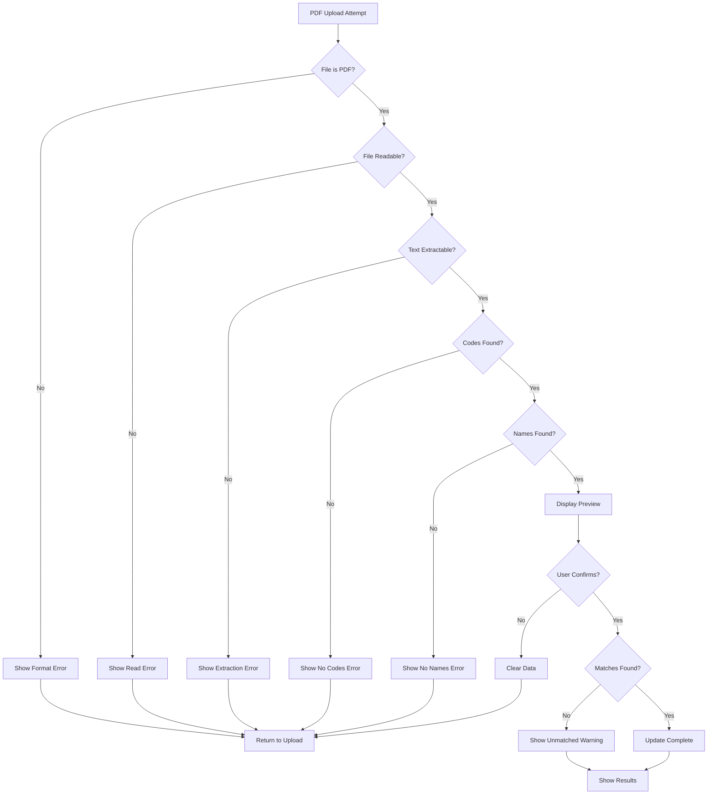
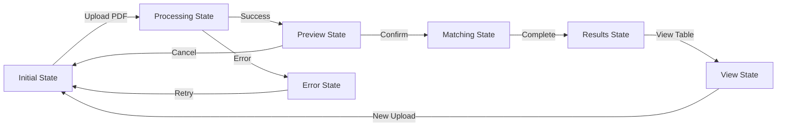
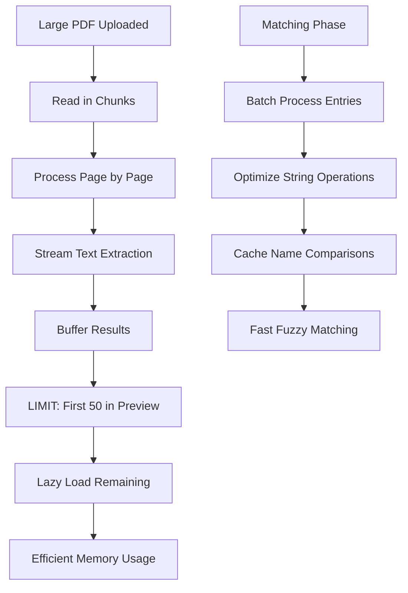
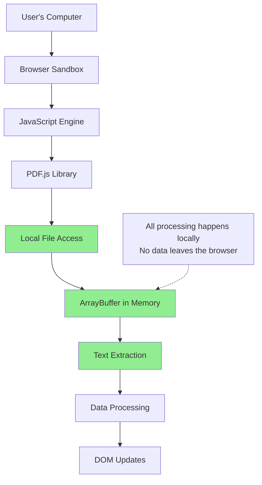

# PDF Upload Feature - Visual Flow Diagram

## System Architecture

## Data Extraction Flow

## Pattern Matching Strategies

## Fuzzy Matching Process

## User Interface Flow

## Component Interaction

## Error Handling Flow

## State Management

## Performance Optimization

## Security Model

---

## Legend

- **Rectangle**: Process or Action
- **Diamond**: Decision Point
- **Circle**: Start/End Point
- **Arrow**: Data Flow
- **Green Fill**: Secure/Local Operation
- **Subgraph**: Component Grouping

---

**Note:** These diagrams illustrate the complete flow of the PDF upload and extraction feature, from user interaction to data matching and table updates.
